# Deep Research System Architecture

## Overview

The LLMpedia Deep Research system is a sophisticated multi-agent research orchestration platform that conducts comprehensive academic research queries using a three-phase workflow. The system leverages specialized AI agents working in parallel to investigate complex research questions across multiple data sources (arXiv papers and Reddit discussions), synthesizing findings into coherent, well-sourced reports.

## System Architecture Overview

```mermaid
graph TD
    A[User Query] --> B[DeepResearchOrchestrator]
    B --> C[🎯 PHASE 1: SCOPE]
    B --> D[🤖 PHASE 2: RESEARCH] 
    B --> E[📝 PHASE 3: SYNTHESIS]
    
    C --> F[ResearchSupervisor]
    F --> G[Research Brief Creation]
    G --> H[Subtopic Identification]
    
    D --> I[Agent Assignment]
    I --> J[Research Agent 1<br/>Subtopic A]
    I --> K[Research Agent 2<br/>Subtopic B] 
    I --> L[Research Agent 3<br/>Subtopic C]
    
    J --> M[arXiv Search]
    J --> N[Reddit Search]
    K --> O[arXiv Search]
    K --> P[Reddit Search]
    L --> Q[arXiv Search]
    L --> R[Reddit Search]
    
    M --> S[Document Analysis]
    N --> S
    O --> T[Document Analysis]
    P --> T
    Q --> U[Document Analysis]
    R --> U
    
    S --> V[Agent Findings 1]
    T --> W[Agent Findings 2]
    U --> X[Agent Findings 3]
    
    E --> Y[Report Synthesis]
    V --> Y
    W --> Y
    X --> Y
    Y --> Z[Final Research Report]
```



## Core Components

| Component | Role | Key Responsibilities |
|-----------|------|---------------------|
| **DeepResearchOrchestrator** | Main Coordinator | Phase orchestration, agent management, progress tracking |
| **ResearchSupervisor** | Research Planner | Question analysis, brief creation, agent assignments |
| **ResearchAgent** | Research Executor | Semantic search, document retrieval, insight extraction |

## Three-Phase Research Pipeline

```mermaid
sequenceDiagram
    participant U as User
    participant O as Orchestrator
    participant S as Supervisor
    participant A1 as Agent 1
    participant A2 as Agent 2
    participant A3 as Agent 3
    participant DB as Database
    
    U->>O: Research Query
    
    Note over O,S: 🎯 PHASE 1: SCOPE
    O->>S: Analyze Question
    S->>S: Create Research Brief
    S->>O: Research Plan (1-5 subtopics)
    
    Note over O,A3: 🤖 PHASE 2: RESEARCH  
    O->>S: Create Agent Assignments
    S->>O: Agent Tasks
    
    par Parallel Research
        O->>A1: Research Subtopic A
        A1->>DB: arXiv + Reddit Search
        DB->>A1: Documents
        A1->>A1: Analyze & Extract Insights
        A1->>O: Findings A
    and
        O->>A2: Research Subtopic B  
        A2->>DB: arXiv + Reddit Search
        DB->>A2: Documents
        A2->>A2: Analyze & Extract Insights
        A2->>O: Findings B
    and
        O->>A3: Research Subtopic C
        A3->>DB: arXiv + Reddit Search  
        DB->>A3: Documents
        A3->>A3: Analyze & Extract Insights
        A3->>O: Findings C
    end
    
    Note over O,U: 📝 PHASE 3: SYNTHESIS
    O->>O: Synthesize All Findings
    O->>U: Final Research Report
```



### Phase Details

| Phase | Duration | Key Activities | Output |
|-------|----------|---------------|---------|
| **🎯 SCOPE** | ~5% | Question analysis, research planning, subtopic identification | `ResearchBrief` |
| **🤖 RESEARCH** | ~85% | Parallel agent execution, document retrieval, insight extraction | `AgentFindings[]` |
| **📝 SYNTHESIS** | ~10% | Cross-agent analysis, report generation, source attribution | `FinalReport` |

### Agent Research Process Detail

Each research agent follows this optimized pipeline:

```
┌─────────────────┐    ┌──────────────────┐    ┌─────────────────┐
│  Semantic       │───▶│  Vector Search   │───▶│  Document       │
│  Query Design   │    │  (arXiv/Reddit)  │    │  Retrieval      │
└─────────────────┘    └──────────────────┘    └─────────────────┘
                                                         │
┌─────────────────┐    ┌──────────────────┐    ┌─────────────────┐
│  Insight        │◀───│  LLM Analysis    │◀───│  LLM Relevance  │
│  Extraction     │    │  & Synthesis     │    │  Reranking      │ 
└─────────────────┘    └──────────────────┘    └─────────────────┘
                                                         │
                                               ┌─────────────────┐
                                               │  Deduplication  │
                                               │  (Cross-Agent)  │
                                               └─────────────────┘
```

## Data Sources & Integration

### arXiv Papers
- **Access Method**: Semantic vector search across pre-indexed abstracts
- **Metadata**: Title, abstract, publication date, citations, full text notes
- **Filtering**: Date constraints, citation thresholds, relevance scoring
- **Deduplication**: arXiv code tracking across agents

### Reddit Discussions  
- **Access Method**: Semantic search across post content with automatic top comment fetching
- **Content Types**: Posts, comment threads (top 3 comments per post), community insights
- **Metadata**: Subreddit, author, score, publication date, comment count
- **Enhancement**: Automatic top comment retrieval (min 5 score) for enriched context

### Cross-Source Intelligence
- **Complementary Perspectives**: Academic rigor + practitioner experiences
- **Temporal Coverage**: Recent papers + ongoing community discussions
- **Quality Signals**: Citation counts + community engagement metrics

## Data Flow & Models


### Core Research Models

| Model | Purpose | Key Fields | Phase |
|-------|---------|------------|-------|
| **`ResearchBrief`** | Research planning output | `focused_question`, `key_subtopics`, `research_scope` | 🎯 SCOPE |
| **`SubTopicAssignment`** | Agent task specification | `subtopic`, `semantic_queries`, `sources`, `search_strategy` | 🤖 RESEARCH |
| **`AgentFindings`** | Individual agent results | `key_insights`, `referenced_papers`, `research_gaps` | 🤖 RESEARCH |
| **`FinalReport`** | Synthesized final output | `title`, `response`, `referenced_papers` | 📝 SYNTHESIS |

<details>
<summary><strong>Complete Model Schemas</strong></summary>

#### `ResearchBrief`
```python
focused_question: str          # Refined research question
research_scope: str           # Clear scope definition  
key_subtopics: List[str]      # 1-5 independent subtopics
expected_timeline: str        # Relevant time period
```

#### `SubTopicAssignment` 
```python
subtopic: str                 # Specific research focus
search_strategy: str          # Tailored search approach
semantic_queries: List[str]   # 2-3 optimized search queries
expected_findings: str        # Expected contribution type
sources: List[str]           # ["arxiv"], ["reddit"], or both
min/max_publication_date     # Optional temporal constraints
```

#### `AgentFindings`
```python
subtopic: str                 # Researched subtopic
key_insights: List[str]       # 3-5 most important insights
supporting_evidence: List[str] # Specific evidence and findings
referenced_papers: List[str]   # arXiv codes for key papers
research_gaps: List[str]      # Identified limitations/gaps
community_insights: List[str]  # Reddit-derived insights (optional)
reddit_references: List[str]   # Reddit post IDs (optional)
```

#### `FinalReport`
```python
title: str                    # Punchy summary of key finding
response: str                 # Final formatted response
referenced_papers: List[str]  # Complete arXiv code list
```

</details>

## Workflow Intelligence & Optimization

### Search Strategy Optimization
- **Query Diversification**: Multiple semantic queries per subtopic to capture different aspects
- **Academic Language Targeting**: Queries phrased as abstract-like text for better similarity matching
- **Breadth-Depth Balance**: Balances comprehensive coverage with focused expertise

### Quality Control Mechanisms  
- **Multi-Stage Filtering**: Vector similarity → LLM relevance → human-calibrated thresholds
- **Source Diversification**: Cross-agent deduplication prevents duplicate papers across agents
- **Progress Streaming**: Real-time progress updates via callback system for transparency
- **Temporal Intelligence**: Adaptive date constraints based on query intent ("recent" = last 1-2 months)

### Performance Features
- **Parallel Execution**: All agents research simultaneously for speed
- **Resource Management**: Configurable agent limits and source quotas
- **Progress Streaming**: Real-time progress updates via callback system
- **Error Resilience**: Graceful handling of empty results or API failures

## System Configuration

| Parameter | Range | Default | Impact |
|-----------|-------|---------|---------|
| **Agent Count** | 1-5 | 4 | Parallel research breadth |
| **Sources per Agent** | 5-20 | 10 | Research depth vs. speed |
| **Response Length** | 1000-8000 | 4000 | Synthesis comprehensiveness |
| **LLM Temperature** | 0.0-2.0 | 0.4-1.0 | Creativity vs. accuracy |

## Performance Metrics

```mermaid
pie title Research Execution Time Distribution
    "🎯 Scoping (5%)" : 5
    "🤖 Research (85%)" : 85  
    "📝 Synthesis (10%)" : 10
```



### Typical Performance Characteristics

| Metric | Range | Notes |
|--------|-------|-------|
| **Total Duration** | 30-90 seconds | Varies with agent count and source depth |
| **Token Consumption** | 15K-40K | Includes all LLM interactions |
| **Source Coverage** | 8-30 papers + 0-15 Reddit posts | Per complete research session |
| **Parallel Efficiency** | 3x speedup | Compared to sequential agent execution |

## Quality Assurance Pipeline


## Integration Architecture

The deep research system seamlessly integrates with LLMpedia's existing infrastructure:

- **🗄️ Database Layer**: Pre-computed embeddings, workflow logging, cost tracking
- **🤖 LLM Layer**: Multi-model support with structured output enforcement  
- **🎨 UI Layer**: Real-time progress streaming and rich result presentation
- **📊 Analytics Layer**: Complete audit trails and performance monitoring

This architecture enables LLMpedia to conduct sophisticated academic research that combines the rigor of peer-reviewed literature with the practical insights of practitioner communities, delivering comprehensive, well-sourced responses to complex research questions while maintaining full transparency and traceability.