# Deep Research UI & Progress Streaming

## Overview

The LLMpedia Deep Research UI provides real-time progress streaming and rich result presentation during multi-agent research workflows. The system delivers live updates via callback-based progress streaming, transforming technical research execution into an engaging, transparent user experience with visual timeline tracking, phase indicators, and live statistics.

## Progress Streaming Architecture


## Message Flow & Frequency

### Progress Message Distribution

```mermaid
pie title Average Progress Messages Per Phase (Total: ~15-25)
    "🎯 Phase 1 (3-4 messages)" : 20
    "🤖 Phase 2 (10-18 messages)" : 70
    "📝 Phase 3 (2-3 messages)" : 10
```



### Detailed Message Breakdown

| Phase | Message Count | Message Types | Example Messages |
|-------|---------------|---------------|------------------|
| **🎯 Phase 1** | 3-4 messages | Setup, brief creation, subtopic listing | `"🎯 PHASE 1: Creating focused research brief..."` |
| **🤖 Phase 2** | 10-18 messages | Agent deployment, search progress, completions | `"🤖 Agent 2/3: Researching 'RAG retrieval methods'..."` |
| **📝 Phase 3** | 2-3 messages | Synthesis start, final metrics | `"📝 PHASE 3: Synthesizing 15 insights from 12 papers..."` |

## UI Component Architecture

### Core UI Components


### State Management Structure

```python
progress_state = {
    "current_phase": str,           # "Phase 1: Research Planning"
    "phase_details": str,           # Current sub-activity description
    "agents_total": int,            # Total number of research agents
    "agents_completed": int,        # Completed agent count
    "current_agent": int,           # Currently active agent (1-based)
    "activity_log": List[str],      # Recent 4 activities (rolling window)
    "total_activities": int,        # Cumulative activity counter
    "insights_found": int,          # Total insights discovered
    "papers_found": int,            # Total papers referenced
    "content_container": st.empty   # UI container reference
}
```

## Progress Message Parsing

### Message Pattern Recognition

The system uses regex-based parsing to extract structured information from progress strings:

| Pattern | Regex | Extracted Data | UI Update |
|---------|--------|----------------|-----------|
| **Phase Transitions** | `"PHASE (\d+):"` | Phase number, description | Main status label |
| **Agent Progress** | `"Agent (\d+)/(\d+)"` | Current/total agents | Progress indicator |
| **Agent Completion** | `"(\d+) insights, (\d+) papers"` | Metrics increment | Statistics counters |
| **Search Activities** | `"📚\|💬\|📄"` | Source type, document counts | Timeline entries |

### Real-Time State Updates

<details>
<summary><strong>Message Parsing Logic</strong></summary>

```python
def parse_research_progress_message(message: str) -> dict:
    updates = {}
    
    # Phase detection
    if "PHASE 1:" in message:
        updates["current_phase"] = "Phase 1: Research Planning"
        updates["phase_details"] = "Analyzing question and creating research brief"
    elif "PHASE 2:" in message:
        updates["current_phase"] = "Phase 2: Multi-Agent Research" 
        updates["phase_details"] = "Deploying specialized research agents"
    elif "PHASE 3:" in message:
        updates["current_phase"] = "Phase 3: Synthesis"
        updates["phase_details"] = "Combining findings into final response"
    
    # Agent tracking
    agent_match = re.search(r"Agent (\d+)/(\d+)", message)
    if agent_match:
        updates["current_agent"] = int(agent_match.group(1))
        updates["agents_total"] = int(agent_match.group(2))
    
    # Metrics extraction
    if "completed:" in message:
        updates["agents_completed"] += 1
        insight_match = re.search(r"(\d+) insights", message)
        papers_match = re.search(r"(\d+) papers", message)
        if insight_match:
            updates["insights_found"] += int(insight_match.group(1))
        if papers_match:
            updates["papers_found"] += int(papers_match.group(1))
    
    return updates
```

</details>

## Visual Timeline Design

### Timeline Component Features

```mermaid
graph LR
    A[Activity Log] --> B[Icon Classification]
    B --> C[Color Coding]
    C --> D[Timeline Rendering]
    
    B --> E[🎯 Phase Icons]
    B --> F[🤖 Agent Icons] 
    B --> G[✅ Completion Icons]
    B --> H[📝 General Icons]
    
    C --> I[Phase: #b31b1b]
    C --> J[Agent: #2196f3]
    C --> K[Complete: #4caf50]
    C --> L[General: #9c27b0]
```



### Timeline UI Elements

| Element | Design | Purpose |
|---------|--------|---------|
| **Activity Icons** | Color-coded circles with emojis | Visual activity categorization |
| **Connector Lines** | Vertical lines between activities | Timeline flow indication |
| **Activity Counter** | `#N Activity description` | Step numbering and context |
| **Truncation Indicator** | `⋯ N earlier activities...` | Manages visual overflow |
| **Pulse Animation** | CSS keyframe animation | Live activity indicator |

### Activity Window Management

The UI maintains a **rolling window of 4 recent activities** while tracking total activity count:

```python
# Activity log management
progress_state["activity_log"].append(message)
progress_state["total_activities"] += 1
if len(progress_state["activity_log"]) > 4:
    progress_state["activity_log"] = progress_state["activity_log"][-4:]
```

## Statistics Display

### Real-Time Metrics Panel

```mermaid
graph TB
    A[Statistics Panel] --> B[Insights Counter]
    A --> C[Papers Counter]
    A --> D[Agent Progress]
    
    B --> E[📡 Live Updates]
    C --> F[📊 Source Tracking]
    D --> G[🤖 Agent Status]
    
    E --> H[Purple Accent: #673ab7]
    F --> I[Blue Accent: #2196f3]
    G --> J[Status Label Updates]
```



### Statistics Card Design

The compact statistics panel provides live metrics using LLMpedia's design system:

| Metric | Display Style | Color | Update Trigger |
|--------|---------------|-------|----------------|
| **💡 Insights** | Large number (2xl font) | Purple (#673ab7) | Agent completion messages |
| **📄 Papers** | Large number (2xl font) | Blue (#2196f3) | Agent completion messages |
| **Agent Progress** | Status label fraction | Dynamic | Agent start/completion |

## Progress Message Catalog

### Phase 1: Research Scoping (3-4 messages)

| Message | Frequency | UI Impact |
|---------|-----------|-----------|
| `"🎯 PHASE 1: Creating focused research brief..."` | Always (1x) | Phase transition, status update |
| `"🧠 Analyzing question and creating research focus..."` | Always (1x) | Activity timeline entry |
| `"📋 Research brief: What are latest advances in RAG?"` | Always (1x) | Brief preview display |
| `"🔀 Breaking down into 3 subtopics..."` | Always (1x) | Subtopic count indication |
| `"   1. RAG retrieval methods"` | Per subtopic | Verbose mode subtopic listing |

### Phase 2: Multi-Agent Research (10-18 messages)

| Message Pattern | Frequency | UI Impact |
|-----------------|-----------|-----------|
| `"🤖 PHASE 2: Deploying research agents..."` | Always (1x) | Phase transition |
| `"🔍 Starting research with N specialized agents..."` | Always (1x) | Agent count setup |
| `"🤖 Agent X/N: Researching 'subtopic'..."` | Per agent (3-5x) | Current agent indicator |
| `"      📚 Searching arXiv papers..."` | Per agent (verbose) | Source search activity |
| `"      💬 Searching Reddit discussions..."` | Per agent (verbose) | Community search activity |
| `"      📄 Found X candidate sources"` | Per agent (verbose) | Document discovery |
| `"      ⚖️ Reranking X sources for relevance..."` | Per agent (verbose) | Document filtering |
| `"      🧠 Analyzing sources and extracting insights..."` | Per agent (verbose) | Analysis phase |
| `"✅ Agent X completed: Y insights, Z papers"` | Per agent (3-5x) | Completion with metrics |

### Phase 3: Synthesis (2-3 messages)

| Message | Frequency | UI Impact |
|---------|-----------|-----------|
| `"📝 PHASE 3: Synthesizing X insights from Y papers..."` | Always (1x) | Phase transition with totals |
| `"🎉 Research complete! Generated Z word response with N referenced papers"` | Always (1x) | Final completion status |

## User Experience Design Decisions

### Visual Hierarchy Principles

1. **Phase Prominence**: Large status labels with phase indicators take visual priority
2. **Activity Recency**: Recent activities have higher opacity, older ones fade
3. **Metric Emphasis**: Large, colorful numbers draw attention to research progress
4. **Timeline Continuity**: Connector lines and consistent spacing create flow

### Information Density Management

| UI Section | Information Density | Design Strategy |
|------------|-------------------|-----------------|
| **Main Status** | High | Single-line phase + agent progress |
| **Timeline** | Medium | 4 recent activities with truncation |
| **Statistics** | Low | 2 large metrics with minimal text |

### Responsive Design Considerations

- **Column Layout**: 3:1 ratio (Timeline:Stats) optimizes screen usage
- **Text Truncation**: Long messages cut at 200 characters with ellipsis
- **Icon Sizing**: 20px circular icons balance visibility and space
- **Color Accessibility**: High contrast colors work in light/dark modes

## Performance & Optimization

### UI Update Frequency


### Update Performance Characteristics

| Metric | Value | Notes |
|--------|-------|-------|
| **Update Frequency** | 0.5-2 seconds | Variable based on phase activity |
| **Timeline Rendering** | <50ms | Lightweight HTML generation |
| **State Management** | <10ms | In-memory dictionary updates |
| **Total UI Overhead** | <5% | Minimal impact on research performance |

## Integration with Research Pipeline

### Callback Integration Points

The progress system integrates seamlessly with the research pipeline through strategic callback placement:

```python
# Research orchestration with UI updates
def conduct_deep_research(self, user_question: str, progress_callback: Callable):
    # Phase transitions trigger major UI updates
    progress_callback("🎯 PHASE 1: Creating focused research brief...")
    
    # Agent operations provide detailed progress
    for i, assignment in enumerate(assignments, 1):
        progress_callback(f"🤖 Agent {i}/{len(assignments)}: Researching '{assignment.subtopic}'...")
        
        # Agent completion triggers metric updates
        progress_callback(f"✅ Agent {i} completed: {insights_count} insights, {papers_count} papers")
```

### Error Handling & Fallbacks

- **Connection Issues**: Timeline shows last successful update with error indicator
- **Parsing Failures**: Graceful fallback to raw message display  
- **UI Container Errors**: Progress continues in console with user notification
- **State Corruption**: Automatic state reset with preserved activity count

## Future Enhancement Opportunities

### Potential UI Improvements

1. **Interactive Timeline**: Clickable entries to expand full message details
2. **Progress Persistence**: Save/restore progress state across sessions
3. **Export Functionality**: Timeline export for research audit trails
4. **Custom Notifications**: User-configurable progress alerts
5. **Visual Agent Status**: Individual agent progress bars and status indicators

### Advanced Features

- **Research Replay**: Step-through mode for completed research sessions
- **Performance Analytics**: Research duration and efficiency metrics
- **Source Preview**: Hover previews of discovered papers and insights
- **Collaborative Mode**: Multi-user progress sharing and comments

The Deep Research UI transforms complex multi-agent research execution into an engaging, transparent experience that builds user confidence through comprehensive progress visibility and real-time feedback, while maintaining optimal performance and visual clarity throughout the research workflow.